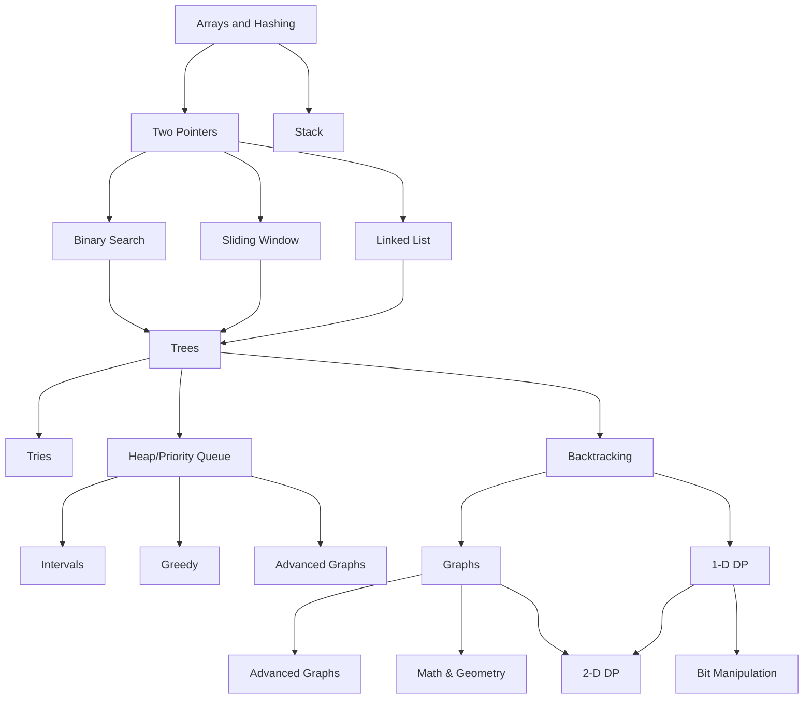

## About
This is a repo where I'll save my leetcode journey

**Table of Content**
1. [Important Terms](#important-terms)
2. [Roadmap](#roadmap)
3. [Data Structure & Algorithms Implementations](#dsa-implementations)
4. [Leetcode 150+](#🥋-leetcode-150)
5. [Challenges](#🥷-codewars)

## Important terms
> **Algorithm**: step-by-step instructions for solving a problem or completing a task

> **Data structure**: a way of organizing, storing, and managing data so that it can be used efficiently

> **Asymptotic Notations**: notations used to measure how well an algorithm scales as its input size increases. i.e 'how would a chosen algorithm perform when given an array of 10 element, 10 000 element or 1 million elements'

These include:
- Big O Notation (O): Upper Bound (worst case)
- Omega Notation (Ω): Lower Bound (average case)
- Theta Notation (Θ): Tight Bound (best case)

> **Time complexity**: a theoretical estimation of how an algorithm's running time grows based on the size of the input

> **Running/execution time**: the actual time it takes for the algorithm to execute on a specific input with a real system and specific data

> **Space Complexity**: a measure of the amount of memory an algorithm needs in order to run to completion

When comparing different algorithms, it's better to use the Big-O notation since it's independant of the hardware and system used to run it, which affect the performance.

## Roadmap

> *By [Neetcode](https://neetcode.io/roadmap)*

## DSA Implementations

#### Data Structures
|Name|Solutions|Strength|Weakness|Great-for|
|--|--|--|--|--|
|Dynamic Array|[C](./c/vector.c), [Python](./python/_vector.py)| **O(1)** read/write at index, add/remove at end| **O(N)** search, insert/delete at middle|random access, memory efficient, rapid sort O(nlogn)|
|Singly-Linked-List|[C](./c/singly-linked-list.c), [Python](./python/_singly-linked-list.py)| **O(1)** add or pop end/front, insert to middle if already there, no shifting | **O(N)** find, insert/remove middle if starting from head |maleability and changes in the middle|
|Hash Tables|||||
|Tree|||||
|Trie|||||
|Graph|||||

#### Sort/Search Algorithms
|Name|Solutions|Strength|Weakness|
|--|--|--|--|
|Selection Sort||||
|Bubble Sort||||
|Quick Sort||||
|Merge Sort||||
|Linear Search||||
|Binary Search||||
|Breath-First-Search||||
|Depth-First-Search||||

## 🥋 Leetcode 150+
#### Arrays & Hashing
|#|Title|Solutions|Time|Space|Difficulty|Notes|
|:-:|-|:-:|:-:|:--:|:--:|--|
|0001|Two Sum|[Python](./python/0001-two-sum.py)|O(n)|O(n)|Easy|hashmap pair checker|
|0049|Group Anagrams|[Python](./python/0049-group-anagrams.py)|O(n)|O(n)|Easy||
|0217|Contains Duplicates|[Python](./python/0217-contains-duplicates.py)|O(n)|O(n)|Easy|hashmap pair checker|

#### Prefix Sum [🔗](https://leetcode.com/tag/prefix-sum/)
|#|Title|Solutions|Time|Space|Difficulty|Notes|
|:-:|-|:-:|:-:|:--:|:--:|--|
|2574|Left and right sum difference|[Python](./python/2574-left-and-right-sum-difference.py)|O(n)|O(n)|Easy||

#### Two Pointers
|#|Title|Solutions|Time|Space|Difficulty|Notes|
|:-:|-|:-:|:-:|:--:|:--:|--|
||||||||

#### Stack
|#|Title|Solutions|Time|Space|Difficulty|Notes|
|:-:|-|:-:|:-:|:--:|:--:|--|
|0020|Valid Paranthesis|[Python](./python/0020-valid-paranthesis.py)|O(n)|O(n)|Easy||
|0155|Min Stack|[Python](./python/0155-min-stack.py)|||Easy||

#### Binary Search
|#|Title|Solutions|Time|Space|Difficulty|Notes|
|:-:|-|:-:|:-:|:--:|:--:|--|
||||||||

#### Sliding Window
|#|Title|Solutions|Time|Space|Difficulty|Notes|
|:-:|-|:-:|:-:|:--:|:--:|--|
||||||||

#### Linked-List
|#|Title|Solutions|Time|Space|Difficulty|Notes|
|:-:|-|:-:|:-:|:--:|:--:|--|
|0707|Design a linked list|[Python](./python/0707-design-linked-list.py)|see above||||
|0206|Reverse Linked List|[Python](./python/0206-reverse-linked-list.py)|O(n)|O(1)|Medium|save state (prev, curr, next), dummy nodes help|

#### Trees
|#|Title|Solutions|Time|Space|Difficulty|Notes|
|:-:|-|:-:|:-:|:--:|:--:|--|
||||||||

#### Backtracking
|#|Title|Solutions|Time|Space|Difficulty|Notes|
|:-:|-|:-:|:-:|:--:|:--:|--|
||||||||

#### Graphs
|#|Title|Solutions|Time|Space|Difficulty|Notes|
|:-:|-|:-:|:-:|:--:|:--:|--|
||||||||

#### Heap/Priority Queue
|#|Title|Solutions|Time|Space|Difficulty|Notes|
|:-:|-|:-:|:-:|:--:|:--:|--|
||||||||

#### 1-D Dynamic Programming
|#|Title|Solutions|Time|Space|Difficulty|Notes|
|:-:|-|:-:|:-:|:--:|:--:|--|
||||||||

#### Advanced Graphs
|#|Title|Solutions|Time|Space|Difficulty|Notes|
|:-:|-|:-:|:-:|:--:|:--:|--|
||||||||

#### Intervals
|#|Title|Solutions|Time|Space|Difficulty|Notes|
|:-:|-|:-:|:-:|:--:|:--:|--|
||||||||

#### Tries
|#|Title|Solutions|Time|Space|Difficulty|Notes|
|:-:|-|:-:|:-:|:--:|:--:|--|
||||||||

#### Greedy
|#|Title|Solutions|Time|Space|Difficulty|Notes|
|:-:|-|:-:|:-:|:--:|:--:|--|
||||||||

#### 2-D Dynamic Programming
|#|Title|Solutions|Time|Space|Difficulty|Notes|
|:-:|-|:-:|:-:|:--:|:--:|--|
||||||||

#### Bit Manipulation
|#|Title|Solutions|Time|Space|Difficulty|Notes|
|:-:|-|:-:|:-:|:--:|:--:|--|
||||||||

#### Math & Geometry
|#|Title|Solutions|Time|Space|Difficulty|Notes|
|:-:|-|:-:|:-:|:--:|:--:|--|
||||||||

## 🥷 Challenges

Sites: [Codewars](https://www.codewars.com/), [Project Euler](https://projecteuler.net/archives)
|#|Title|Solutions|Time|Space|Difficulty|From|
|:-:|-|:-:|:-:|:--:|:--:|--|
||||||||

## Ressources
- **Grokking Algorithms** : great introduction to algorithms + visual exemples + code in Python ([Book](https://www.amazon.com.be/-/en/Aditya-Bhargava/dp/1617292230/ref=asc_df_1617292230/))
- **Cracking the Coding Interview** : the bible of tech interviews ([Book](https://www.amazon.com.be/-/en/Gayle-Laakmann-McDowell/dp/0984782850))
- **Neetcode**: best site to learn data structures & algorithms and practice ([Website](https://neetcode.io/))
- **Coding interview university** : great roadmap and practice plan ([Github](https://github.com/jwasham/coding-interview-university))
- **Leetcode**: practice solving problems ([Website](https://leetcode.com/))
