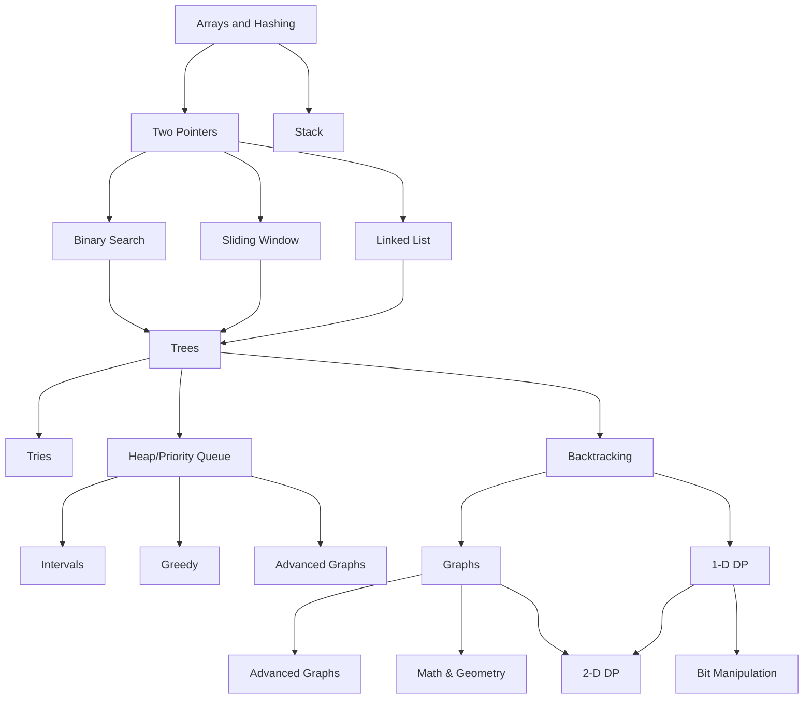

# Dojo
## Playground to practice and prepare for technical interviews

**Outline**
1. [Data Structures, Algorithms & Key Concepts](#data-structures--algorithms)
2. [Problem solving](#problem-solving)
3. [Projects](#projects)
5. [System Design](#system-design) (Bonus)

## Data Structures & Algorithms
> Data structures and algorithms help organize and process data efficiently. Data structures optimize storage and operations for specific needs, algorithms provide methods for tasks like sorting and searching. Understanding them is essential for developing efficient, scalable software, enabling developers to tackle complex problems and create faster, resource-effective applications.

#### Data Structures
|Name|Code|Strength|Weakness|Use case|
|--|--|--|--|--|
|Dynamic Arrays|[C](./src/c/vector.c), [Python](./src/python/_vector.py)| **O(1)** read/write at index, add/remove at end| **O(N)** search, insert/delete at middle|random access, memory efficient, rapid sort O(nlogn)|
|Stack|||||
|Linked-Lists|[C](./src/c/singly-linked-list.c), [Python](./src/python/_singly-linked-list.py)| **O(1)** add or pop end/front, insert to middle if already there, no shifting | **O(N)** find, insert/remove middle if starting from head |maleability and changes in the middle|
|Queues|||||
|Hash Tables|||||
|Binary Trees|||||
|Graph|||||
|Tries|||||
|Heaps|||||

#### Algorithms
|Name|Code|Strength|Weakness|
|--|--|--|--|
|Merge Sort||||
|Quick Sort||||
|Binary Search||||
|Breath-First-Search||||
|Depth-First-Search||||
|Tree insert/find/etc||||

#### Concepts
|Title|Definition|
|-|-|
|Bit manipulation|Bit manipulation involves using bitwise operators to modify individual bits within a binary number. This can include operations like shifting bits left or right, setting a specific bit to 1 or 0, or flipping bits. It's often used for tasks that require high performance, compact storage, or direct hardware control.|
|Recursion|Recursion is a programming technique where a function calls itself to solve smaller parts of a problem, until it reaches a condition that stops further calls. This is useful for problems that can be broken down into similar, smaller problems.|
|Memoization/dynamic programming|Memoization is a technique where you store the results of expensive function calls and return the cached result when the same inputs occur again. This avoids repeated calculations and speeds up the program.    Dynamic programming is an approach that breaks down a complex problem into simpler subproblems and solves each of these subproblems just once, storing their solutions. When a larger problem depends on the solutions of these smaller problems, it uses these stored solutions directly, optimizing the overall computation process. Both techniques are useful for improving performance in problems that involve many repeated calculations.|
|Memory (stack/heap)|A stack is a region of memory where data is added or removed in a last-in, first-out order. It's used for static memory allocation, such as for function call management and local variables.  A heap is a region of memory used for dynamic memory allocation, where blocks of memory can be allocated and freed in any order. This flexibility supports more complex data structures like trees, graphs, and dynamically resized arrays. Both the stack and the heap help manage memory in programs, but they do so in different ways and for different types of data.|
|Big O Notation|Big O notation is a way to describe the efficiency of an algorithm, specifically how its runtime or space requirements grow as the size of the input increases. It focuses on the worst-case scenario, ignoring constants and less significant terms to give a simplified understanding of an algorithm's performance as the input becomes very large. For example, an algorithm with a time complexity of O(n) means its runtime increases linearly with the input size|

## Problem Solving
### Roadmap

    
Problem Sets

##### Arrays & Hashing
|#|Title|Code|Time|Space|Difficulty|Notes|
|:-:|-|:-:|:-:|:--:|:--:|--|
|0217|[Contains Duplicates](https://leetcode.com/problems/contains-duplicate/description/)|[Python](./src/python/0217-contains-duplicates.py)|O(n)|O(n)|Easy|hashmap pair checker|
|0242|[Valid Anagram](https://leetcode.com/problems/valid-anagram/description/)|[Python](./src/python/0242-valid-anagram.ipynb)|O()||||
|0001|[Two Sum](https://leetcode.com/problems/two-sum/description/)|[Python](./src/python/0001-two-sum.py)|O(n)|O(n)|Easy|hashmap pair checker|
|0049|[Group Anagrams](https://leetcode.com/problems/group-anagrams/description/)|[Python](./src/python/0049-group-anagrams.py)|O(n)|O(n)|Easy||
|0347|[Top K Frequent Elements](https://leetcode.com/problems/top-k-frequent-elements/description/)|[Python](./src/python/0347-top-k-frequent-elements.ipynb)|O(n)|O(n)|Medium|hashmap counter|
|0298|[Product of Array Except Self](https://leetcode.com/problems/product-of-array-except-self/description/)|[Python](./src/python/0298-product-of-array-except-self.ipynb)|O(n)|O(n)|Medium|prefix sum & postfix sum|
||||||||

##### Prefix Sum [🔗](https://leetcode.com/tag/prefix-sum/)
|#|Title|Code|Time|Space|Difficulty|Notes|
|:-:|-|:-:|:-:|:--:|:--:|--|
|2574|Left and right sum difference|[Python](./src/python/2574-left-and-right-sum-difference.py)|O(n)|O(n)|Easy||
||||||||

##### Two Pointers
|#|Title|Code|Time|Space|Difficulty|Notes|
|:-:|-|:-:|:-:|:--:|:--:|--|
|0125|[Valid Palindrome](https://leetcode.com/problems/valid-palindrome/description/)|[Python](./src/python/0125-valid-palindrome.ipynb)|O(n)|O(1/n)|Easy|beware conditions before checking|

##### Stack
|#|Title|Code|Time|Space|Difficulty|Notes|
|:-:|-|:-:|:-:|:--:|:--:|--|
|0020|Valid Paranthesis|[Python](./src/python/0020-valid-paranthesis.py)|O(n)|O(n)|Easy||
|0155|Min Stack|[Python](./src/python/0155-min-stack.py)|||Easy||
||||||||

##### Binary Search
|#|Title|Code|Time|Space|Difficulty|Notes|
|:-:|-|:-:|:-:|:--:|:--:|--|
||||||||

##### Sliding Window
|#|Title|Code|Time|Space|Difficulty|Notes|
|:-:|-|:-:|:-:|:--:|:--:|--|
||||||||

##### Linked-List
|#|Title|Code|Time|Space|Difficulty|Notes|
|:-:|-|:-:|:-:|:--:|:--:|--|
|0707|Design a linked list|[Python](./src/python/0707-design-linked-list.py)|see above||||
|0206|Reverse Linked List|[Python](./src/python/0206-reverse-linked-list.py)|O(n)|O(1)|Medium|save state (prev, curr, next), dummy nodes help|
||||||||

##### Trees
|#|Title|Code|Time|Space|Difficulty|Notes|
|:-:|-|:-:|:-:|:--:|:--:|--|
||||||||

##### Backtracking
|#|Title|Code|Time|Space|Difficulty|Notes|
|:-:|-|:-:|:-:|:--:|:--:|--|
||||||||

##### Graphs
|#|Title|Code|Time|Space|Difficulty|Notes|
|:-:|-|:-:|:-:|:--:|:--:|--|
||||||||

##### Heap/Priority Queue
|#|Title|Code|Time|Space|Difficulty|Notes|
|:-:|-|:-:|:-:|:--:|:--:|--|
||||||||

##### 1-D Dynamic Programming
|#|Title|Code|Time|Space|Difficulty|Notes|
|:-:|-|:-:|:-:|:--:|:--:|--|
||||||||

##### Advanced Graphs
|#|Title|Code|Time|Space|Difficulty|Notes|
|:-:|-|:-:|:-:|:--:|:--:|--|
||||||||

##### Intervals
|#|Title|Solutions|Time|Space|Difficulty|Notes|
|:-:|-|:-:|:-:|:--:|:--:|--|
||||||||

##### Tries
|#|Title|Solutions|Time|Space|Difficulty|Notes|
|:-:|-|:-:|:-:|:--:|:--:|--|
||||||||

##### Greedy
|#|Title|Solutions|Time|Space|Difficulty|Notes|
|:-:|-|:-:|:-:|:--:|:--:|--|
||||||||

##### 2-D Dynamic Programming
|#|Title|Solutions|Time|Space|Difficulty|Notes|
|:-:|-|:-:|:-:|:--:|:--:|--|
||||||||

##### Bit Manipulation
|#|Title|Solutions|Time|Space|Difficulty|Notes|
|:-:|-|:-:|:-:|:--:|:--:|--|
||||||||

##### Math & Geometry
|#|Title|Solutions|Time|Space|Difficulty|Notes|
|:-:|-|:-:|:-:|:--:|:--:|--|
||||||||

### Challenges

**Useful Links**
- Grokking Algorithms : great introduction to algorithms + visual exemples + code in Python ([Book](https://www.amazon.com.be/-/en/Aditya-Bhargava/dp/1617292230/ref=asc_df_1617292230/))
- Cracking the Coding Interview : the bible of tech interviews ([Book](https://www.amazon.com.be/-/en/Gayle-Laakmann-McDowell/dp/0984782850))
- Cracking the Tech Career : Insider Advice on Landing a Job at Google, Microsoft, Apple, or any Top Tech Company ([Book](https://www.amazon.com/Cracking-Tech-Career-Insider-Microsoft-ebook/dp/B00MFPZ9X6))
- Neetcode : best site to learn data structures & algorithms and practice ([Website](https://neetcode.io/))
- Leetcode : practice solving problems ([Website](https://leetcode.com/))
- Codewars : random general challenges ([Website](https://www.codewars.com/))
- Example Coding/Engineering Interview by Google ([Youtube](https://youtu.be/XKu_SEDAykw?si=1i-hftxzXND6-e9h))

[⇪ **Back up**](#dojo)

## Full-stack Web Development
#### The internet
- [ ] How does the internet works .... [1](https://cs.fyi/guide/how-does-internet-work), [2](https://www.vox.com/2014/6/16/18076282/the-internet), [3](https://web.stanford.edu/class/msande91si/www-spr04/readings/week1/InternetWhitepaper.htm), [4](https://roadmap.sh/guides/what-is-internet), [5](https://www.youtube.com/watch?v=x3c1ih2NJEg), [6](https://www.youtube.com/watch?v=7_LPdttKXPc), [7](https://www.youtube.com/watch?v=zN8YNNHcaZc), [8](https://www.youtube.com/watch?v=erEgovG9WBs)
- [ ] Domain names/IP addresses .... [1](https://developer.mozilla.org/en-US/docs/Learn/Common_questions/Web_mechanics/What_is_a_domain_name), [2](https://www.cloudflare.com/en-gb/learning/dns/glossary/what-is-a-domain-name/), [3](https://www.youtube.com/watch?v=Y4cRx19nhJk)
- [ ] DNS ........................................... [1](https://www.cloudflare.com/en-gb/learning/dns/what-is-dns/), [2](https://howdns.works/), [3](https://developer.mozilla.org/en-US/docs/Glossary/DNS), [4](https://www.youtube.com/watch?v=Wj0od2ag5sk), [5](https://www.youtube.com/watch?v=7lxgpKh_fRY), [6](https://www.youtube.com/watch?v=zEmUuNFBgN8&list=PLTk5ZYSbd9MhMmOiPhfRJNW7bhxHo4q-K)
- [ ] HTTP ......................................... [1](https://cs.fyi/guide/http-in-depth), [2](https://www.cloudflare.com/en-gb/learning/ddos/glossary/hypertext-transfer-protocol-http/), [3](https://www.youtube.com/watch?v=2JYT5f2isg4), [4](https://developer.mozilla.org/en-US/docs/Web/HTTP/Overview), [5](https://www.smashingmagazine.com/2021/08/http3-core-concepts-part1/), [6](https://www.youtube.com/watch?v=a-sBfyiXysI), [7](https://www.youtube.com/watch?v=iYM2zFP3Zn0), [8](https://www.youtube.com/watch?v=j9QmMEWmcfo)
- [ ] Browsers ................................... [1](https://web.dev/articles/howbrowserswork), [2](https://www.browserstack.com/guide/browser-rendering-engine), [3](https://developer.mozilla.org/en-US/docs/Web/Performance/How_browsers_work)
- [ ] Servers
- [ ] What is hosting .......................... [1](https://www.youtube.com/watch?v=htbY9-yggB0), [2](https://www.youtube.com/watch?v=AXVZYzw8geg), [3](https://www.youtube.com/watch?v=Kx_1NYYJS7Q), [4](https://developer.mozilla.org/en-US/docs/Learn/Common_questions/Web_mechanics/Pages_sites_servers_and_search_engines), [5](https://developer.mozilla.org/en-US/docs/Learn/Common_questions/Web_mechanics/What_is_a_web_server)
- [ ] ISO Model
#### ⚙️ The Back-end
> Save and manage data

- [x] [What is back-end web development](https://www.youtube.com/watch?v=XBu54nfzxAQ)
- [x] Learn a backend language (Python)
    - [x] [CS50's introduction to programming with Python](https://www.youtube.com/playlist?list=PLhQjrBD2T3817j24-GogXmWqO5Q5vYy0V)
- [x] Learn a micro-framework
    - [ ] [Introduction to Flask](https://www.youtube.com/live/oVA0fD13NGI?si=VkWbXLY25LeUDkrE) / [Django](https://campus19.udemy.com/course/python-django-2021-complete-course/)
    - [ ] [Documentation](https://flask.palletsprojects.com/en/3.0.x/)
    - [ ] [Best practice handbook](https://docs.python-guide.org/#)
- [ ] Learn backend development
    - [ ] APIs............................... [1](https://campus19.udemy.com/course/learn-and-understand-apis-and-restful-apis/), [2](https://campus19.udemy.com/course/rest-api-flask-and-python/)
    - [ ] Databases  .....................[1](https://youtu.be/vHYeChEf2lA?si=mPEb39ipV__wbhXj), [2](https://campus19.udemy.com/course/complete-python-postgresql-database-course/)
    - [ ] Authentication .............. [1](https://campus19.udemy.com/course/oauth-2-simplified/), [2](https://www.youtube.com/watch?v=71EU8gnZqZQ)
    - [ ] Testing 

#### 🖼️ The Front-end
> Visualize and interract with your data
- [x] [Watch is Front-end web development](https://www.youtube.com/watch?v=WG5ikvJ2TKA) / [2](https://frontendmasters.com/guides/front-end-handbook/2018/what-is-a-FD.html)
- [ ] Learn HTML
- [ ] Learn CSS
- [ ] Learn Javascript
    - [ ] The basics ....................... [1](https://youtu.be/hdI2bqOjy3c?si=MxtRE83XoZHdfQd7), [2](https://learnjavascript.online/), [3](https://eloquentjavascript.net/)
    - [ ] DOM manipulation .......... [1](https://eloquentjavascript.net/14_dom.html), [2](https://www.youtube.com/watch?v=0ik6X4DJKCc), [3](https://www.javascripttutorial.net/javascript-dom/), [4](https://www.youtube.com/watch?v=7Tok22qxPzQ), [5](https://javascript.info/document)
    - [ ] Fetch API / AJAX (XHR) .. [1](https://web.dev/articles/introduction-to-fetch), [2](https://www.javascripttutorial.net/javascript-fetch-api/), [3](https://developer.mozilla.org/en-US/docs/Web/API/Fetch_API), [4](https://www.youtube.com/watch?v=-ZI0ea5O2oA)
    - [ ] Learn a framework (React, Angular, etc..)

#### 🔗 Connecting the two / [how to](https://stackoverflow.com/questions/68164444/how-to-connect-backend-and-frontend)

#### 🥋 As a junior

**Need to know**
- [ ] **CRUD**: Know how to perform basic Create Read Update and Delete operations. This tells me you know how to set up a Django application, core concepts and how to work with the database and views, and probably the template engine.
- [ ] **Authentication, Authorization & User Roles**: Just like CRUD, handling user permissions and performing basic tasks like registering users and knowing how to work with sessions is a key part in most applications.
- [ ] **Static files**: Images, PDF’s and other static files like CSS and JavaScript files. Do you know where to store these files and how to configure your app to handle user uploaded content?
- [ ] **Building APIs**: Although not every app will have an API, its common practice to use a framework like Django to build an API to use with a frontend framework like React, Vue or Svelte, or even to just provide some public data. Know how API’s work + have a base understanding of implementing REST practices and how to build a Restful API using the Django REST framework.

**Be able to build**
- [ ] **To Do App** — start with some basic CRUD application to learn how to setup an app and work with the database. Challenge yourself and add authentication and user permissions. Try building it twice, one with function based views and one with class based views.
- [ ] **Ecommerce website** — Along with basic CRUD and Authentication that most eCommerce site’s will need, you’ll learn more about complex database relationships when it comes to adding Products, Orders, Tags and more. Building an eCommerce site will teach you a lot about designing your models and complex queries. Let’s also add search, pagination and user roles to that equation.
- [ ] **Social Network** — A social network will also force you to learn about designing your database. For example, how would you build out the “friends” or “following” feature’s? What about likes and determining what post a user will see in their feed.

**Further Reading**
- [Understanding asynchronous I/O; building an event loop from scratch](https://mbinjamil.dev/writings/understanding-async-io/) (Article)

[⇪ **Back up**](#dojo)

## System Design (Bonus)
> Systems design is the process of defining and developing systems to satisfy specified requirements of the user. The basic study of system design is the understanding of component parts and their subsequent interaction with one another.

**What is system design** [[1](https://youtu.be/i53Gi_K3o7I?si=KAb_rU6PrSVcqU1J), [2](https://www.youtube.com/watch?v=m8Icp_Cid5o), [3](https://www.amazon.com/gp/product/0071843655/), [4](https://youtu.be/MbjObHmDbZo?si=EHRkcaXlF9j5eNu4)]

**Main Components**
- Web server ......................................... 1
- Database ............................................ 1
    - Replication .................................. 1
- Load balancer .................................... 1
- CDN (Content Delivery Network) ....... 1, 2
- Cache ................................................. 1
- Message queues ................................
- Loggging, metrics and automations .. 1, 2

**Concepts**
- [Vertical vs horizontal scaling](https://www.youtube.com/watch?v=xpDnVSmNFX0)
- [Statefull vs stateless architecture](https://www.freecodecamp.org/news/stateful-vs-stateless-architectures-explained/)
- [Single Point of Failure](https://en.wikipedia.org/wiki/Single_point_of_failure)
- [Back-of-the-envelope-calculations](https://bytebytego.com/courses/system-design-interview/back-of-the-envelope-estimation)

**Case studies**
- [Scale from zero to millions of users](https://bytebytego.com/courses/system-design-interview/scale-from-zero-to-millions-of-users)
- [Design Spotify](https://youtu.be/_K-eupuDVEc?si=wJkpFj5NpULTA1hq)
- [Design YouTube](https://youtu.be/jPKTo1iGQiE?si=tTnR9g9Qqgqr4voD)
- [Scaling ChatGPT](https://newsletter.pragmaticengineer.com/p/scaling-chatgpt)
- [Choosing technologies](https://newsletter.pragmaticengineer.com/p/real-world-engineering-challenges-55d)
- [Breaking up a Monolith](https://newsletter.pragmaticengineer.com/p/real-world-eng-8)

**Further Reading**
- [Operating Systems](https://pages.cs.wisc.edu/~remzi/OSTEP/)
- [Web Scalability for Startup Engineers](https://www.amazon.com/gp/product/0071843655/) (Book)
- [Designing Data-Intensive Applications: The Big Ideas Behind Reliable, Scalable, and Maintainable Systems](https://www.amazon.com/gp/product/1449373321) (Book)
- [Framework for system design interview](https://bytebytego.com/courses/system-design-interview/a-framework-for-system-design-interviews) (Article)
- [Guide to System Design in 2024](https://www.educative.io/blog/complete-guide-to-system-design#horizontalandverticalscaling) on Educative (Article)
- [System Design Roadmap](https://takeuforward.org/system-design/complete-system-design-roadmap-with-videos-for-sdes/) by Gaurav Sen (Article)

[⇪ **Back up**](#dojo)