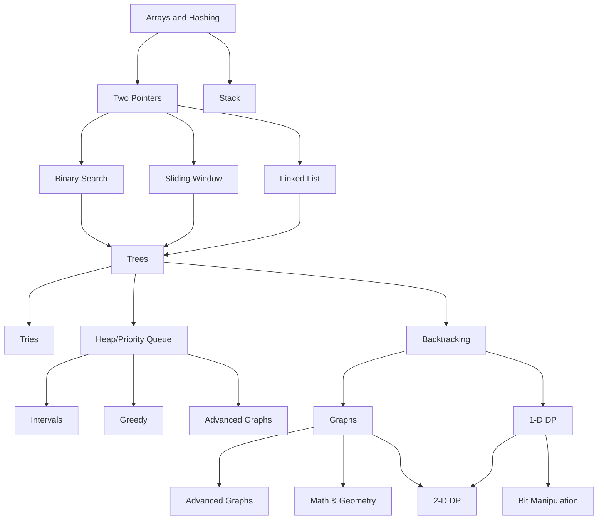

## About
This is a repo where I'll save my leetcode journey

## Important terms
> **Algorithm**: step-by-step instructions for solving a problem or completing a task

> **Data structure**: a way of organizing, storing, and managing data so that it can be used efficiently

> **Asymptotic Notations**: a general term that refers to notations used to describe the running time of an algorithm in terms of input size (n) as n approaches infinity. It provides an upper bound, lower bound, or tight bound on the growth rate of a function. These include:
▪	Big O Notation (O): Upper Bound
▪	Omega Notation (Ω): Lower Bound
▪	Theta Notation (Θ): Tight Bound

> **Big-O Notation**: is a specific type of asymptotic notation. It expresses the upper bound of an algorithm's time/space complexity - the maximum time required by an algorithm for all input values. It gives the worst-case scenario.

> **Time complexity**: a theoretical estimation of how an algorithm's running time grows based on the size of the input

> **Running/execution time**: the actual time it takes for the algorithm to execute on a specific input with a real system and specific data

> **Space Complexity**: a measure of the amount of memory an algorithm needs in order to run to completion

When comparing different algorithms, it's better to use the Big-O notation since it's independant of the hardware and system used to run it, which affect the performance.

## Roadmap

> *By [Neetcode](https://neetcode.io/roadmap)*

## Progress

|#|Title|Solution|Time|Space|Difficulty|Notes|
|-|-|-|-|--|--|--|
||||||||

## Ressources
- **Grokking Algorithms** : great introduction to algorithms + visual exemples + code in Python ([Book](https://www.amazon.com.be/-/en/Aditya-Bhargava/dp/1617292230/ref=asc_df_1617292230/))
- **Cracking the Coding Interview** : the bible of tech interviews ([Book](https://www.amazon.com.be/-/en/Gayle-Laakmann-McDowell/dp/0984782850))
- **Neetcode**: best site to learn data structures & algorithms and practice ([Website](https://neetcode.io/))
- **Coding interview university** : great roadmap and practice plan ([Github](https://github.com/jwasham/coding-interview-university))
- **Leetcode**: practice solving problems ([Website](https://leetcode.com/))
