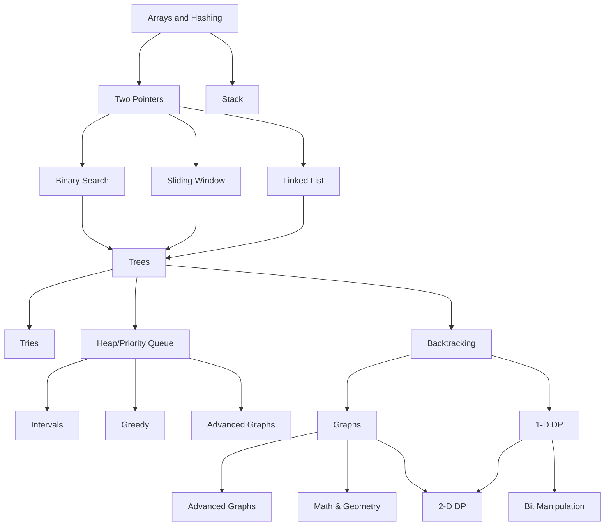

# Welcome to the Dojo

**Outline**
1. [Data Structures & Algorithms](#data-structures--algorithms)
2. [Blind75+](#blind75)
3. [Community Challenges](#community-challenges)

## Data Structures & Algorithms
The basics for writing clean and efficient code.
- [x] Watch: [Introduction to Data Structures](https://www.youtube.com/watch?v=X8h4dq9Hzq8)
- [x] Watch: [Introduction to Algorithms](https://www.youtube.com/live/4oqjcKenCH8?si=58ALyCO1klKIUVnm)

> [!Important]
> For each data structure, algorithm and technique, do the following:
> learn the theory and concepts, then implement it in code and finally solve 5 **EASY** problems.

||||||
|-|:-|:-:|:-:|:-:|
||**Data Structures**: way of organizing data for easier processing|**Theory & Concept**|**Implementation**|**Exercices**|
|<ul><li>- [x] </li></ul>|[Dynamic Arrays](https://en.wikipedia.org/wiki/Dynamic_array)||[C](./src/theory/data_structures/vector.c) - [Python](./src/theory/data_structures/vector.py)|[Leetcode](https://leetcode.com/tag/array/)|
|<ul><li>- [x] </li></ul>|[Linked-List](https://en.wikipedia.org/wiki/Linked_list)||[C](./src/theory/data_structures/singly-linked-list.c) - [Python](./src/theory/data_structures/singly-linked-list.py)|[Leetcode](https://leetcode.com/tag/linked-list/)|
|<ul><li>- [x] </li></ul>|[Stack](https://en.wikipedia.org/wiki/Stack_(abstract_data_type))||[Python](./src/theory/data_structures/stack.ipynb)|[Leetcode](https://leetcode.com/tag/stack/)|
|<ul><li>- [x] </li></ul>|[Queues](https://en.wikipedia.org/wiki/Queue_(abstract_data_type))||[Python](./src/theory/data_structures/deque.ipynb)|[Leetcode](https://leetcode.com/tag/queue/)|
|<ul><li>- [ ] </li></ul>|[Hash Tables](https://en.wikipedia.org/wiki/Hash_table)|[Notes](./src/theory/data_structures/hashmap.ipynb)||[Leetcode](https://leetcode.com/tag/hash-table/)|
|<ul><li>- [ ] </li></ul>|[Binary Trees](https://en.wikipedia.org/wiki/Binary_tree)|||[Leetcode](https://leetcode.com/tag/binary-tree/)|
|<ul><li>- [ ] </li></ul>|[Graph](https://en.wikipedia.org/wiki/Graph_(abstract_data_type))|||[Leetcode](https://leetcode.com/tag/graph/)|
|<ul><li>- [ ] </li></ul>|[Tries](https://en.wikipedia.org/wiki/Tree_(data_structure))|||[Leetcode](https://leetcode.com/tag/trie/)|
|<ul><li>- [ ] </li></ul>|[Heap](https://en.wikipedia.org/wiki/Heap_(data_structure))|||[Leetcode](https://leetcode.com/tag/heap-priority-queue/)|
||||||
||**Algorithms**: step by step instructions for completing a task|**Implementation**|**Exercices**|
|<ul><li>- [ ] </li></ul>|[Insertion Sort](https://www.youtube.com/watch?v=JU767SDMDvA)|||[Leetcode](https://leetcode.com/tag/heap-priority-queue/)|
|<ul><li>- [ ] </li></ul>|[Merge Sort](https://www.youtube.com/watch?v=4VqmGXwpLqc)|||[Leetcode](https://leetcode.com/tag/sorting/)|
|<ul><li>- [ ] </li></ul>|[Quick Sort](https://youtu.be/Hoixgm4-P4M?si=OUJ7I-78ubkbnJtp)|||[Leetcode](https://leetcode.com/tag/sorting/)|
|<ul><li>- [x] </li></ul>|[Binary Search](https://youtu.be/fDKIpRe8GW4?si=WGFySWh7-3bU_iPX)||[Python](./src/theory/algorithms/binary-search.ipynb)|[Leetcode](https://leetcode.com/tag/binary-search/)|
|<ul><li>- [ ] </li></ul>|[Breath-First-Search](https://www.youtube.com/watch?v=HZ5YTanv5QE)|||[Leetcode](https://leetcode.com/tag/breadth-first-search/)|
|<ul><li>- [ ] </li></ul>|[Depth-First-Search](https://www.youtube.com/watch?v=Urx87-NMm6c)|||[Leetcode](https://leetcode.com/tag/depth-first-search/)|
||||||
||**Techniques**: common ways of approaching common problems|**Implementation**|**Exercices**|
|<ul><li>- [ ] </li></ul>|[Two Pointers](https://www.youtube.com/watch?v=-gjxg6Pln50)|||[Leetcode](https://leetcode.com/tag/two-pointers/)|
|<ul><li>- [ ] </li></ul>|[Prefix Sum](https://www.youtube.com/watch?v=7pJo_rM0z_s)|||[Leetcode](https://leetcode.com/tag/prefix-sum/)|
|<ul><li>- [ ] </li></ul>|[Sliding Window](https://www.youtube.com/watch?v=p-ss2JNynmw)|||[Leetcode](https://leetcode.com/tag/sliding-window/)|

## Blind75+
Blind75 is a list of the 75 most popular questions in coding interviews, they cover most useful concepts.

> [!Important]
> 2-3 questions/day, 30min/question, pseudocode then code, brute-force approach then optimize, check edge cases.

[Roadmap](https://neetcode.io/roadmap) + Videos / [Plan](https://www.techinterviewhandbook.org/grind75?grouping=weeks)

## Community Challenges
Random types of problems for fun and general problem solving skills. Site like [Codewars](https://www.codewars.com/) and Codeforces for competitive programming.

**Helpful Concepts**
Specific knowledge that is helpful for certain problems.

||||||
|-|:-:|:-|:-:|:-:|
||**Topic**: |**Ressources**|**Notes**|**Exercices**|
|<ul><li>- [ ] </li></ul>|Math|[Algebra](https://en.khanacademy.org/math/algebra), [Combinatorics](https://www.khanacademy.org/math/precalculus/x9e81a4f98389efdf:prob-comb), [Modular Arithmetic](https://www.khanacademy.org/computing/computer-science/cryptography/modarithmetic/a/what-is-modular-arithmetic), [Number Theory](https://www.youtube.com/playlist?list=PL-BD05SCClbag8KTPzaPzzggJ96aBsVkT) [[2](https://www.youtube.com/watch?v=KOzByAdxVZ8)]||[HackerRank](https://www.hackerrank.com/domains/mathematics)|
|<ul><li>- [ ] </li></ul>|REGEX|- [CS50P: Regular Expressions](https://youtu.be/hy3sd9MOAcc?si=sEJobUQ2B4u_HxCc) - [Cheat-Sheet](https://www.rexegg.com/regex-quickstart.html)||[HackerRank](https://www.hackerrank.com/domains/regex)|
|<ul><li>- [ ] </li></ul>|Encoding|- [Unicode & Character Encodings in Python: A Painless Guide](https://realpython.com/python-encodings-guide/) - [Unicode HOWTO](https://docs.python.org/3/howto/unicode.html) - [Article with long name](https://www.joelonsoftware.com/2003/10/08/the-absolute-minimum-every-software-developer-absolutely-positively-must-know-about-unicode-and-character-sets-no-excuses/) - [Another article with a long name](https://kunststube.net/encoding/)||/|
|<ul><li>- [ ] </li></ul>|Bit Manipulation|- [Bitwise Operators and WHY we use them](https://youtu.be/igIjGxF2J-w?si=qqp_lOOqN2fyj27A) - [Bitwise Operations for Competitive Programming](https://www.youtube.com/watch?v=1um-WUyjess)||/|

[⇪ **Back up**](#dojo)
