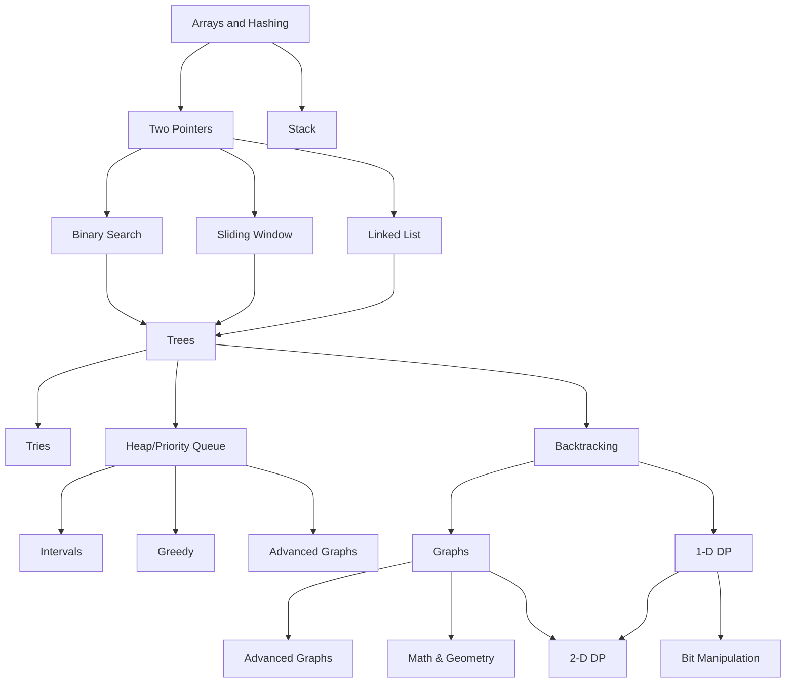

## About
This repo is where I'll share my leetcode solutions and learnings

#### Définitions
> Algorithme: 

> Structure de donnée: 

> Big-O: 

> Complexité en temps:

> Complexité en espace: 

## Roadmap

> *By [Neetcode](https://neetcode.io/roadmap)*

## Plan
#### 1st Month
> 2x easy Qs/day (60Qs total)

|Day|Q1|Q2|Notes|
|-|-|-|-|
|1||||
|2||||
|3||||
|4||||
|5||||
|6||||
|7||||
|8||||
|9||||
|10||||
|11||||
|12||||
|13||||
|14||||
|15||||
|16||||
|17||||
|18||||
|19||||
|20||||
|21||||
|22||||
|23||||
|24||||
|25||||
|26||||
|27||||
|28||||
|29||||
|30||||

#### 2nd Month: week 1&2
> 4x easy Qs/day ()
#### 2nd Month: week 3&4
> 2x medium Qs/day
#### 3rd Month
> 1x hard Q/day

## Ressources
- **Grokking Algorithms** : great introduction to algorithms + visual exemples + code in Python ([Book](https://www.amazon.com.be/-/en/Aditya-Bhargava/dp/1617292230/ref=asc_df_1617292230/))
- **Cracking the Coding Interview** : the bible of tech interviews ([Book](https://www.amazon.com.be/-/en/Gayle-Laakmann-McDowell/dp/0984782850))
- **Neetcode**: best site to learn data structures & algorithms and practice ([Website](https://neetcode.io/))
- **Coding interview university** : great roadmap and practice plan ([Github](https://github.com/jwasham/coding-interview-university))
- **Leetcode**: practice solving problems ([Website](https://leetcode.com/))
- **Python for Coding Interviews**: everything you need to Know ([Video](https://www.youtube.com/watch?v=0K_eZGS5NsU))