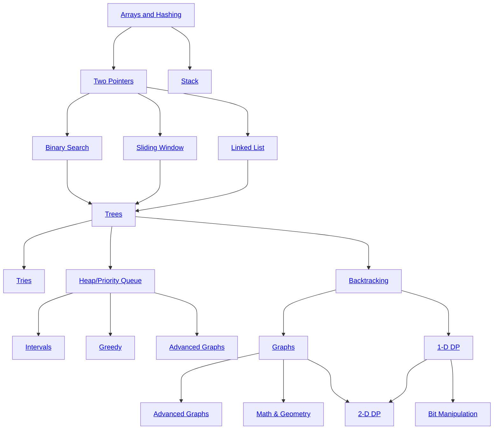

# Leetcode

### Roadmap

##### Arrays & Hashing
|#|Title|Code|Time|Space|Difficulty|Notes|
|:-:|-|:-:|:-:|:--:|:--:|--|
|0217|[Contains Duplicates](https://leetcode.com/problems/contains-duplicate/description/)|[Python](./src/python/0217-contains-duplicates.py)|O(n)|O(n)|Easy|hashmap pair checker|
|0242|[Valid Anagram](https://leetcode.com/problems/valid-anagram/description/)|[Python](./src/python/0242-valid-anagram.ipynb)|O()||||
|0001|[Two Sum](https://leetcode.com/problems/two-sum/description/)|[Python](./src/python/0001-two-sum.py)|O(n)|O(n)|Easy|hashmap pair checker|
|0049|[Group Anagrams](https://leetcode.com/problems/group-anagrams/description/)|[Python](./src/python/0049-group-anagrams.py)|O(n)|O(n)|Easy||
|0347|[Top K Frequent Elements](https://leetcode.com/problems/top-k-frequent-elements/description/)|[Python](./src/python/0347-top-k-frequent-elements.ipynb)|O(n)|O(n)|Medium|hashmap counter|
|0298|[Product of Array Except Self](https://leetcode.com/problems/product-of-array-except-self/description/)|[Python](./src/python/0298-product-of-array-except-self.ipynb)|O(n)|O(n)|Medium|prefix sum & postfix sum|
||||||||

##### Prefix Sum [🔗](https://leetcode.com/tag/prefix-sum/)
|#|Title|Code|Time|Space|Difficulty|Notes|
|:-:|-|:-:|:-:|:--:|:--:|--|
|2574|Left and right sum difference|[Python](./src/python/2574-left-and-right-sum-difference.py)|O(n)|O(n)|Easy||
||||||||

##### Two Pointers
|#|Title|Code|Time|Space|Difficulty|Notes|
|:-:|-|:-:|:-:|:--:|:--:|--|
|0125|[Valid Palindrome](https://leetcode.com/problems/valid-palindrome/description/)|[Python](./src/python/0125-valid-palindrome.ipynb)|O(n)|O(1/n)|Easy|beware conditions before checking|

##### Stack
|#|Title|Code|Time|Space|Difficulty|Notes|
|:-:|-|:-:|:-:|:--:|:--:|--|
|0020|Valid Paranthesis|[Python](./src/python/0020-valid-paranthesis.py)|O(n)|O(n)|Easy||
|0155|Min Stack|[Python](./src/python/0155-min-stack.py)|||Easy||
||||||||

##### Binary Search
|#|Title|Code|Time|Space|Difficulty|Notes|
|:-:|-|:-:|:-:|:--:|:--:|--|
||||||||

##### Sliding Window
|#|Title|Code|Time|Space|Difficulty|Notes|
|:-:|-|:-:|:-:|:--:|:--:|--|
||||||||

##### Linked-List
|#|Title|Code|Time|Space|Difficulty|Notes|
|:-:|-|:-:|:-:|:--:|:--:|--|
|0707|Design a linked list|[Python](./src/python/0707-design-linked-list.py)|see above||||
|0206|Reverse Linked List|[Python](./src/python/0206-reverse-linked-list.py)|O(n)|O(1)|Medium|save state (prev, curr, next), dummy nodes help|
||||||||

##### Trees
|#|Title|Code|Time|Space|Difficulty|Notes|
|:-:|-|:-:|:-:|:--:|:--:|--|
||||||||

##### Backtracking
|#|Title|Code|Time|Space|Difficulty|Notes|
|:-:|-|:-:|:-:|:--:|:--:|--|
||||||||

##### Graphs
|#|Title|Code|Time|Space|Difficulty|Notes|
|:-:|-|:-:|:-:|:--:|:--:|--|
||||||||

##### Heap/Priority Queue
|#|Title|Code|Time|Space|Difficulty|Notes|
|:-:|-|:-:|:-:|:--:|:--:|--|
||||||||

##### 1-D Dynamic Programming
|#|Title|Code|Time|Space|Difficulty|Notes|
|:-:|-|:-:|:-:|:--:|:--:|--|
||||||||

##### Advanced Graphs
|#|Title|Code|Time|Space|Difficulty|Notes|
|:-:|-|:-:|:-:|:--:|:--:|--|
||||||||

##### Intervals
|#|Title|Solutions|Time|Space|Difficulty|Notes|
|:-:|-|:-:|:-:|:--:|:--:|--|
||||||||

##### Tries
|#|Title|Solutions|Time|Space|Difficulty|Notes|
|:-:|-|:-:|:-:|:--:|:--:|--|
||||||||

##### Greedy
|#|Title|Solutions|Time|Space|Difficulty|Notes|
|:-:|-|:-:|:-:|:--:|:--:|--|
||||||||

##### 2-D Dynamic Programming
|#|Title|Solutions|Time|Space|Difficulty|Notes|
|:-:|-|:-:|:-:|:--:|:--:|--|
||||||||

##### Bit Manipulation
|#|Title|Solutions|Time|Space|Difficulty|Notes|
|:-:|-|:-:|:-:|:--:|:--:|--|
||||||||

##### Math & Geometry
|#|Title|Solutions|Time|Space|Difficulty|Notes|
|:-:|-|:-:|:-:|:--:|:--:|--|
||||||||

#### Useful Links

- [Grokking Algorithms](https://www.amazon.com.be/-/en/Aditya-Bhargava/dp/1617292230/ref=asc_df_1617292230/) : soft introduction to algorithms (Book)
- [Cracking the Coding Interview](https://www.amazon.com.be/-/en/Gayle-Laakmann-McDowell/dp/0984782850) : the bible of tech interviews
- [Cracking the Tech Career](https://www.amazon.com/Cracking-Tech-Career-Insider-Microsoft-ebook/dp/B00MFPZ9X6) : Insider Advice on Landing a Job at Google, Microsoft, Apple, or any Top Tech Company
- [Neetcode](https://neetcode.io/) : best site to learn data structures & algorithms and practice
- Mock interviews ([Google](https://youtu.be/XKu_SEDAykw?si=1i-hftxzXND6-e9h), [Others](https://www.youtube.com/@interviewingio/videos))
